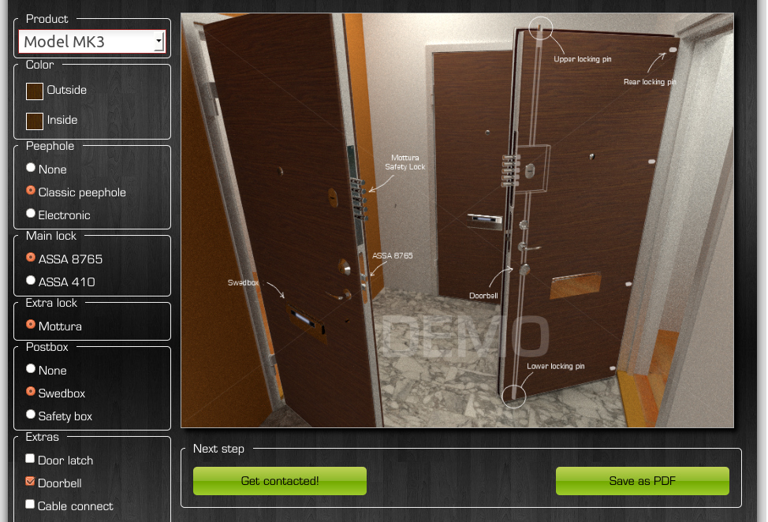

An archive of my 3D modeling work from period 2011-2013.. 

I'm putting these here in the hope that they would be useful.  

Some of the models here have been manufactured into real products either by me
(using 3d printing) or by others. Other models were either used as marketing
material or as part of demo content.  

Note: some of the blender files may be slightly different from the ones used in
renderings below. I had to recover them from multiple backups over a span of a
few years so they are not necessarily latest version. 

")

")

License
-------

This work is distributed under GPL version 3, meaning that you can modify the
source files (blender) however you like, but you are required to release your
modifications to whomever you later distribute the files. 

	Copyright (c) 2011-2016 Martin K. Schröder <mkschreder.uk@gmail.com>

About me
--------

I'm a freelancer with a wide array of experiences. These files are from time
when I was exploring 3d rendering. I have over the years explored many
different lines of work having enjoyed developing many different skills along
the way.  

If you have any questions about my work, you are welcome to contact me: 

	Email: mkschreder.uk@gmail.com

